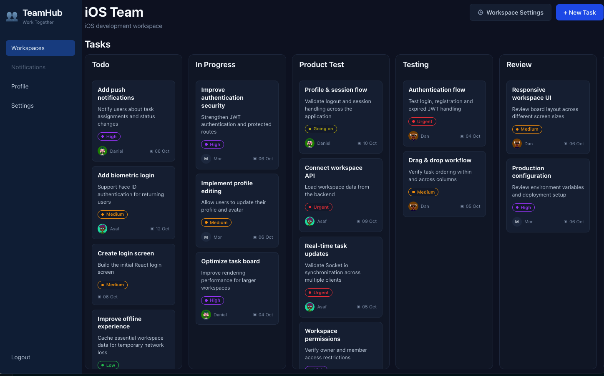
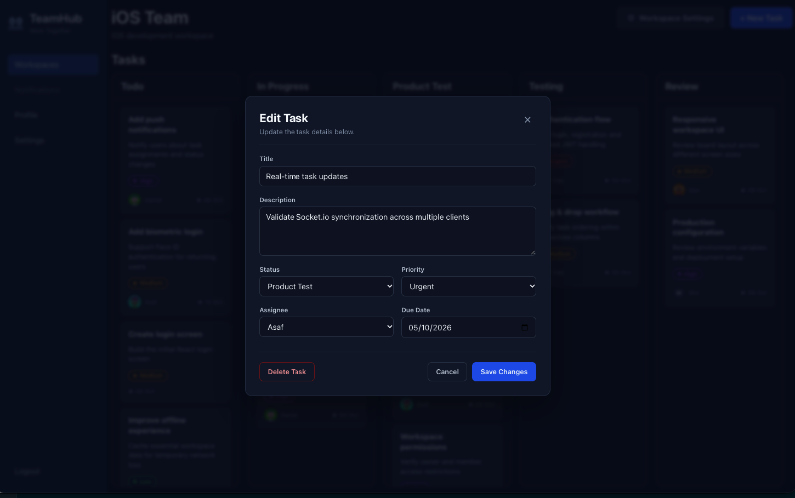
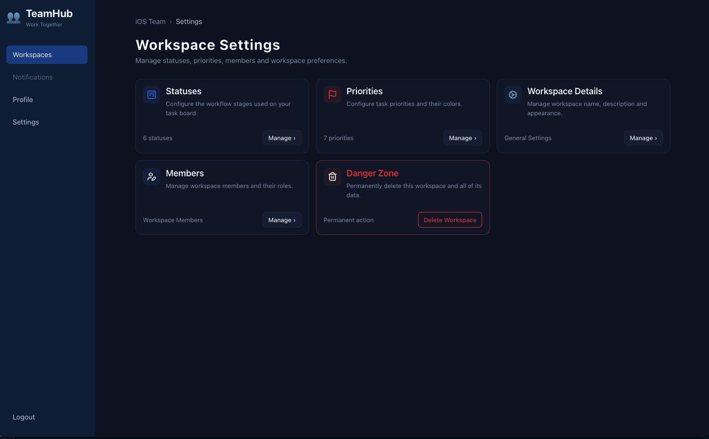
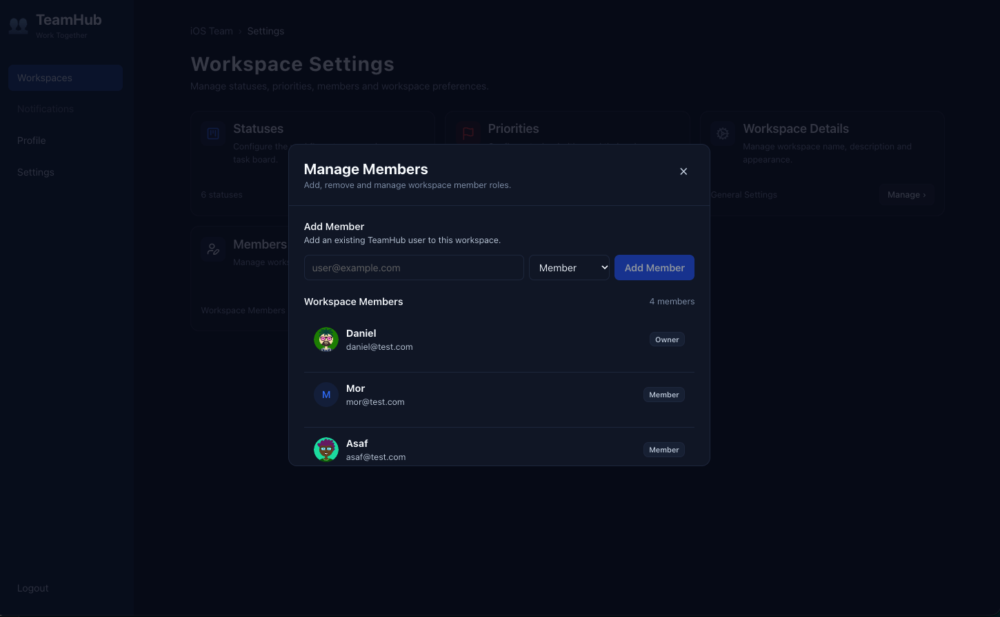
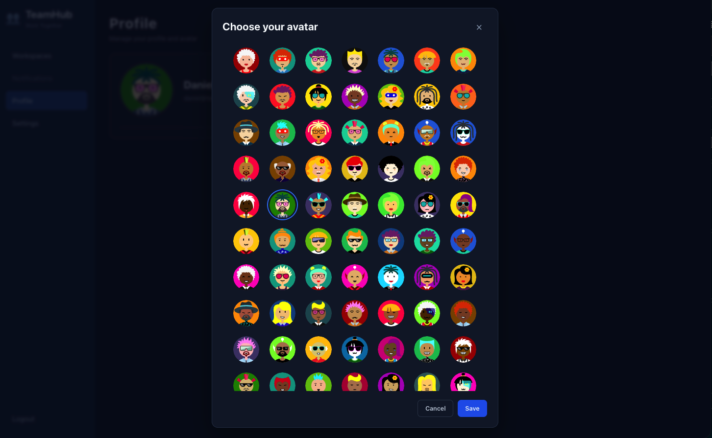
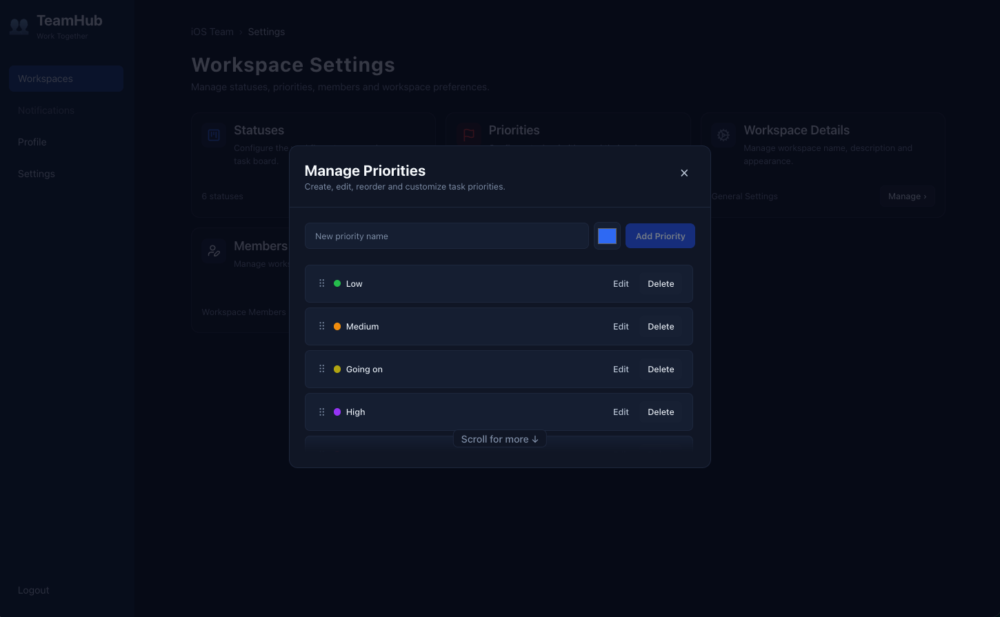

# TeamHub

**A full stack team collaboration platform for managing workspaces,
tasks, workflows and real-time team activity.**

TeamHub combines a React and TypeScript client with a Node.js, Express
and MongoDB backend. It provides authenticated workspaces, configurable
Kanban boards, task management, member roles, custom priorities and
statuses, and real-time synchronization between connected users with
Socket.io.


<p align="center">



</p>

## Overview

TeamHub was built as a complete full stack project with a clear
separation between the client, API, business logic and data access
layers.

The application is designed around collaborative workspaces. Each
workspace has its own members, tasks, workflow statuses and priorities.
Users can manage tasks through a Kanban interface, reorder cards with
drag and drop, assign tasks to workspace members and see task changes
appear in real time across connected clients.

The project focuses not only on CRUD functionality, but also on
authentication, authorization, validation, reusable architecture,
persistent data, real-time communication and a polished user experience.

## Key Features

### Authentication and user profiles

-   User registration and login
-   JWT based authentication
-   Protected client routes
-   Protected server endpoints
-   Current user profile retrieval and updates
-   Persistent authentication token handling
-   Automatic handling of expired or invalid authentication sessions
-   Custom avatar selection with a large avatar collection

### Workspace management

-   Create and manage multiple workspaces
-   Edit workspace name and description
-   Workspace membership management
-   Owner and member roles
-   Administrative protection for workspace management operations
-   Add existing TeamHub users to a workspace
-   Delete workspaces through a dedicated danger zone

### Kanban task management

-   Create, read, update and delete tasks
-   Configurable workflow columns
-   Drag and drop task movement
-   Reorder tasks inside the same column
-   Move tasks between different workflow stages
-   Task title and description
-   Task priority
-   Task assignee
-   Due dates
-   Workspace specific task boards
-   Optimistic board interaction with persistent server updates

### Configurable workflows

TeamHub does not rely on a fixed Kanban workflow.

Workspace users can manage their own:

-   Task statuses
-   Status ordering
-   Task priorities
-   Priority ordering
-   Priority colors

New workspaces receive default statuses and priorities, which can then
be customized to match the team's workflow.

### Real-time collaboration with Socket.io

Real-time communication is a core part of TeamHub.

The application uses **Socket.io** on both the server and client to
synchronize task activity between users connected to the same workspace.

The real-time flow includes:

-   JWT authentication during the socket connection
-   Workspace membership verification before joining a socket room
-   Dedicated Socket.io rooms for individual workspaces
-   Join and leave handling when navigating between workspaces
-   Real-time task creation
-   Real-time task updates
-   Real-time task deletion
-   Real-time task reordering
-   Targeted client state updates without reloading the entire board

The REST API remains the source of truth for write operations. After a
successful database operation, the server broadcasts the relevant event
to the workspace room. This keeps MongoDB authoritative while Socket.io
handles fast distribution of changes to connected clients.

## Screenshots

### Task management


<p align="center">



</p>

Tasks include status, priority, assignee and due date information and
can be edited directly from the board.

### Workspace settings


<p align="center">



</p>

Each workspace provides centralized management for statuses, priorities,
members, workspace details and deletion.

### Member management


<p align="center">



</p>

Workspace owners can add existing TeamHub users and manage workspace
membership.

### Avatar customization


<p align="center">



</p>

Users can personalize their profile by choosing from a large collection
of generated avatars.

### Custom priorities


<p align="center">



</p>

Priorities are workspace specific and can be created, edited, reordered
and assigned custom colors.

## Tech Stack

| Area | Technologies |
| --- | --- |
| Frontend | React 19, TypeScript, Vite |
| State Management | Redux Toolkit, React Redux |
| Routing | React Router |
| HTTP Client | Axios |
| Drag and Drop | dnd-kit |
| Real-time Client | Socket.io Client |
| Backend | Node.js, Express 5 |
| Database | MongoDB, Mongoose |
| Authentication | JSON Web Tokens, bcrypt |
| Validation | express-validator |
| Real-time Server | Socket.io |
| Styling | CSS Modules, shared design tokens and themes |

## Architecture

## Architecture

TeamHub uses a feature based frontend and a layered backend
architecture.

### Client

The React application is organized around application features such as
authentication, tasks, workspaces and settings.

``` text
client/src/
├── api/
├── assets/
├── features/
│   ├── auth/
│   ├── settings/
│   ├── tasks/
│   └── workspaces/
├── layouts/
├── routes/
├── services/
├── store/
├── styles/
└── utils/
```

Redux Toolkit manages shared application state, Axios provides the REST
API layer, React Router handles protected navigation, and Socket.io
Client receives real-time workspace events.

### Server

The backend separates HTTP routing, validation, controllers, business
logic and database access.

``` text
server/src/
├── config/
├── constants/
├── controllers/
├── middleware/
├── models/
├── repositories/
├── routes/
├── services/
├── socket/
├── utils/
└── validators/
```

The main request flow is:

``` text
Route
  -> Authentication / Authorization Middleware
  -> Validation
  -> Controller
  -> Service
  -> Repository
  -> MongoDB
```

This structure keeps controllers focused on HTTP concerns, services
focused on business rules and repositories focused on data access.

## Data Model

The backend uses Mongoose models for the main application entities:

-   `User`
-   `Workspace`
-   `Membership`
-   `Task`
-   `TaskStatus`
-   `TaskPriority`

Memberships connect users to workspaces and provide the foundation for
workspace level access control.

Tasks belong to a workspace and reference the workflow data required by
the Kanban board, including status, priority and assignee information.

## API Overview

The REST API is organized under `/api`.

### Authentication

``` text
POST   /api/auth/register
POST   /api/auth/login
GET    /api/auth/me
PATCH  /api/auth/me
```

### Workspaces

``` text
POST   /api/workspaces
GET    /api/workspaces
GET    /api/workspaces/:id
PATCH  /api/workspaces/:workspaceId
DELETE /api/workspaces/:workspaceId

GET    /api/workspaces/:workspaceId/members
POST   /api/workspaces/:workspaceId/members
```

### Tasks

``` text
POST   /api/workspaces/:workspaceId/tasks
GET    /api/workspaces/:workspaceId/tasks
GET    /api/workspaces/:workspaceId/tasks/:taskId
PATCH  /api/workspaces/:workspaceId/tasks/:taskId
DELETE /api/workspaces/:workspaceId/tasks/:taskId
PATCH  /api/workspaces/:workspaceId/tasks/reorder
```

### Statuses and priorities

Workspace task routes also provide endpoints for:

-   Creating statuses and priorities
-   Updating statuses and priorities
-   Deleting statuses and priorities
-   Reordering statuses and priorities

## Security and Validation

TeamHub includes several layers of request protection:

-   Password hashing with bcrypt
-   JWT authentication for protected REST endpoints
-   JWT authentication for Socket.io connections
-   Protected routes on the React client
-   Workspace membership checks for real-time rooms
-   Workspace administration middleware for protected management
    operations
-   Request validation with express-validator
-   Environment based configuration for secrets and connection strings

Secrets and local environment files are excluded from version control.
Example environment files are included to document the required
configuration.

## Getting Started

### Prerequisites

Make sure the following are available:

-   Node.js
-   npm
-   MongoDB database or MongoDB Atlas cluster

### 1. Clone the repository

``` bash
git clone <repository-url>
cd TeamHub
```

### 2. Configure the server

``` bash
cd server
npm install
```

Create a `.env` file based on `server/.env.example`:

``` env
PORT=4002
NODE_ENV=development
MONGODB_URI=your_mongodb_connection_string
JWT_SECRET=your_jwt_secret
JWT_EXPIRES_IN=1h
CLIENT_URL=http://localhost:5173
```

Start the development server:

``` bash
npm run dev
```

The example configuration runs the API on:

``` text
http://localhost:4002
```

### 3. Configure the client

Open another terminal:

``` bash
cd client
npm install
```

Create a `.env.local` file based on `client/.env.example`:

``` env
VITE_API_BASE_URL=http://localhost:4002/api
VITE_SOCKET_URL=http://localhost:4002
```

Start the client:

``` bash
npm run dev
```

With the default Vite configuration, the client is typically available
at:

``` text
http://localhost:5173
```

If Vite selects a different port, update `CLIENT_URL` on the server
accordingly.

## Production Build

The React client includes a production build command:

``` bash
cd client
npm run build
```

The build performs TypeScript compilation followed by a Vite production
build.

## Real-time Event Flow

A typical real-time task update follows this sequence:

``` text
User action
  -> REST API request
  -> Authentication and validation
  -> Service and repository update
  -> MongoDB persistence
  -> Socket.io workspace event
  -> Connected workspace clients
  -> Local UI state update
```

This approach avoids using WebSockets as the primary persistence
mechanism. The database operation completes first, and only then is the
change broadcast to connected users.

## UI and UX

The interface was designed around a dark workspace experience with
reusable visual tokens and component level styling.

Highlights include:

-   Responsive workspace layout
-   Kanban columns with independent task scrolling
-   Fixed column headers
-   Priority color indicators
-   User avatars
-   Modal based task editing
-   Workspace management dialogs
-   Visual feedback for real-time task movement
-   Reusable theme and design tokens
-   Clear empty, loading and management states

## Project Structure

``` text
TeamHub/
├── client/
│   ├── src/
│   ├── .env.example
│   └── package.json
│
├── server/
│   ├── src/
│   ├── .env.example
│   └── package.json
│
├── docs/
│   └── screenshots/
│
├── .gitignore
└── README.md
```

## Future Improvements

The current version focuses on the core collaboration and task
management experience. Possible future improvements include:

-   Persistent notification system
-   More granular workspace permissions
-   Activity history and audit trail
-   User presence indicators
-   Additional real-time collaboration events
-   MongoDB transactions for multi-document workspace creation
-   Deployment configuration for a hosted production environment
-   Automated API and UI test coverage
-   Additional performance optimization and client side code splitting

## Project Goals

TeamHub was created to bring together the main concepts of a modern full
stack application in one cohesive project:

-   Building a typed React frontend
-   Managing global application state
-   Designing REST APIs
-   Structuring a maintainable Node.js backend
-   Working with MongoDB relationships
-   Implementing authentication and authorization
-   Validating incoming data
-   Building configurable application workflows
-   Adding real-time collaboration with Socket.io
-   Connecting frontend, backend and database behavior into a complete
    user experience

## Author

**Asaf Berko**

Full Stack project built as part of my continued software development
studies and hands-on work with modern web technologies.
